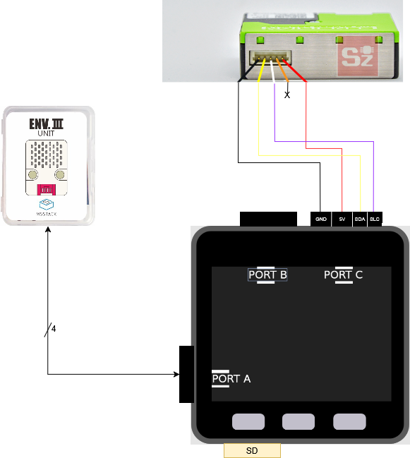

# Breathe

Breathe is an ESP32-based project designed on the M5Stack platform to capture and save air quality data. The system connects to the internet at the beginning to retrieve the current date and time (via NTP), disconnects, and adds a timestamp to each measurement for accurate time tracking.

## Hardware

The project uses the **M5Stack ESP32 development board** as the main controller. The air quality is measured using the following sensors:

- **ENVIII**: A sensor from M5Stack that measures various air quality parameters, including temperature, humidity, and concentration of gases such as CO2 and VOCs.
- **SPS30**: A particulate matter sensor that measures particulate matter (PM1.0, PM2.5, and PM10) in the air.

Both sensors communicate with the ESP32 over I2C.

## Features

- **Real-time Air Quality Monitoring**: Captures real-time air quality data and displays it on the M5Stack screen.
- **Data Logging**: Saves air quality data to an SD card for later analysis, with each data point timestamped based on the time retrieved from the internet.
- **Wi-Fi Connectivity**: The system connects to Wi-Fi at startup to retrieve the current time from an NTP server, then disconnects to minimize power usage.
- **Configurable Parameters**: System parameters, including Wi-Fi credentials, are stored in a `config.cfg` file on the SD card.

## Setup

1. **Hardware Setup**: 
   - Connect the ENVIII and SPS30 sensors to the M5Stack ESP32 as shown in the diagram above.
   - Insert an SD card into the M5Stack.

2. **Software Setup**:
   - Install the required libraries in the Arduino IDE.
   - Open the `Breathe.ino` file in the Arduino IDE.
   - Set up the Wi-Fi credentials in the `config.cfg` file located on the SD card. This file should contain the SSID and password for your Wi-Fi network as shown:

    config.cfg content:

    [WIFI_CREDENTIALS]
    SSID=YOUR-WIFI-SSID
    PASSWORD=YOUR-WIFI-PASSWORD

   - Upload the sketch to the M5Stack board.

